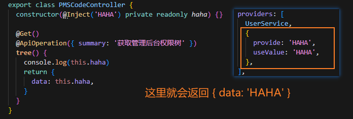
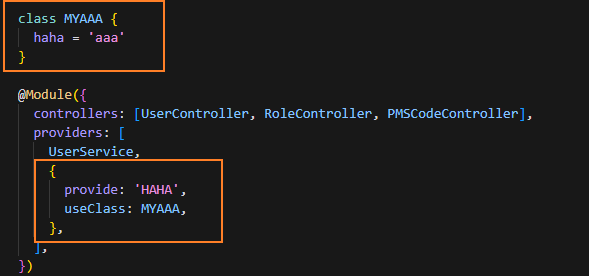
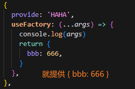
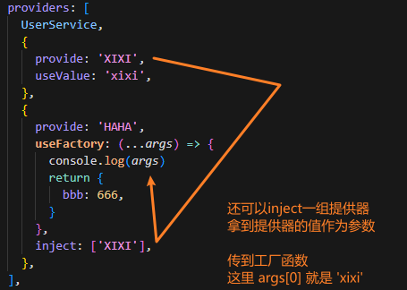

# Nestjs学习小记

本文主要记录一些概念备忘，更多还是得看文档。

## 依赖注入

### 手写一个迷你依赖注入

```js
// 定义一个简单的依赖注入容器
class DIContainer {
  constructor() {
    this.dependencies = {}
  }

  // 注册依赖
  register(name, dependency) {
    this.dependencies[name] = dependency
  }

  // 解析依赖
  resolve(deps, func) {
    const resolvedDeps = deps.map(dep => {
      if (!this.dependencies[dep]) {
        throw new Error(`Dependency ${dep} not found`)
      }
      return this.dependencies[dep]
    })
    return () => func(...resolvedDeps)
  }
}

// 使用示例

// 创建一个容器实例
const container = new DIContainer()

// 注册一些依赖
container.register('logger', console)
container.register('config', { apiUrl: 'https://api.example.com' })

// 定义一个需要依赖的函数
function fetchData(logger, config) {
  logger.log(`Fetching data from ${config.apiUrl}`)
  // 模拟数据获取
  return { data: 'Sample Data' }
}

// 解析依赖并执行函数
const fetchDataWithDeps = container.resolve(['logger', 'config'], fetchData)
const result = fetchDataWithDeps()
console.log(result)
```

小型代码里面，不使用依赖注入也没什么所谓，可能就是写成：
```js
fetchData(logger, config)
```

但是在大型应用中通常是模块化的，为了更好处理模块间依赖，依赖注入模式优势就出来了，引入一个第三者（依赖注入容器）来管理这些依赖，具体可以看上面的代码。提供什么、不提供什么就会很清晰，nestjs就是这种模式。

使用依赖注入的优势：

1. 降低耦合：通过将依赖注入到函数中，函数不再直接依赖于具体的实现，增强了模块化。
2. 提高可测试性：可以轻松地在测试中替换依赖，使用模拟对象或其他实现来进行单元测试。
3. 增强灵活性：可以在运行时动态配置和更改依赖，适应不同的环境和需求。
4. 提高可维护性：依赖注入使得代码更易于理解和维护，因为依赖关系是显式的，而不是隐藏在函数内部。

### 理解nestjs中的依赖注入

说白了这模式就是三个角色：

1. 提供者（Provider）：提供依赖的实体，在nestjs里可以是类、函数、值等。
2. 消费者（Consumer）：使用依赖的实体，依赖于提供者提供的依赖。
3. 容器（Container）：这里就是交给nestjs处理，开发者无需关心。

注入这里又有`注入令牌`（也就是key，上例中dependencies的name）和`注入值`。

* 服务提供者
  
  也是nestjs最常见的，提供依赖（其实这里试了下不用 @Injectable 也可以，目前没看源码不确定里面做了啥... 但官网说要加上）：
  ```js
  // 告诉 nest 这个可以被注入，也就是类似上例中注册了
  // MyService 是令牌，值是 MyService 实例，nestjs会自动new
  @Injectable()
  class MyService {
    constructor(private readonly logger: Logger) {}
  }
  ```
  ```js
  @Module({
    providers: [
      MyService,
    ],
  })
  ```

  使用依赖：
  ```js
  class MyController {
    // nestjs根据这个自动注入实例
    constructor(private readonly myService: MyService) {}
  }
  ```

* 值提供者

  可以看这个例子，使用`@Inject`注入：

  

* 类提供者

  

  就会提供类实例

* 工厂函数提供者

  

  

  