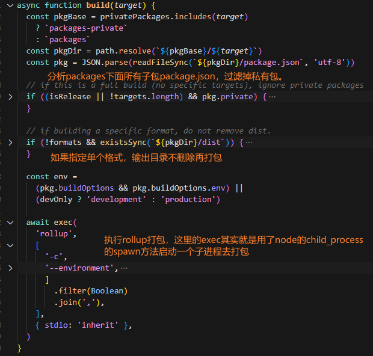

# Vue@3.5.4 源码分析

**注：本文的分析均基于`vue@3.5.4`版本上叙述。且为了可读性需要，以下展示的源码将省略部分类型及泛型声明、注释等，仅突出主逻辑，若有特殊需要请自行查阅项目工程。**

## 项目总览

项目源码拉取：[Github仓库](https://github.com/vuejs/core)

项目启动与开发指南：[Github贡献指南](https://github.com/vuejs/core/blob/main/.github/contributing.md#development-setup)，可以详细了解到项目的构建、启动、测试、提交等流程。

根据[github原话](https://github.com/vuejs/core/blob/main/.github/contributing.md#project-structure)，仓库采用`pnpm + monorepo`方式搭建，packages 目录下托管了许多相关的代码包：

| 包名            | 描述                                                                                                                                                                                                   |
| --------------- | ------------------------------------------------------------------------------------------------------------------------------------------------------------------------------------------------------ |
| reactivity      | 响应式系统，它可以独立用作与框架无关的软件包。                                                                                                                                                         |
| runtime-core    | 与平台无关的运行时核心。包括用于虚拟 dom 渲染器、组件实现和 JavaScript API 的代码。可以使用此包创建针对特定平台的高阶运行时（即自定义渲染器）。                                                        |
| runtime-dom     | 面向浏览器的运行时。包括对本地 DOM API、attrs、props、事件处理程序等的处理。                                                                                                                           |
| runtime-test    | 用于测试的轻量级运行时。可以在任何 JavaScript 环境中使用，因为它 “渲染” 了一棵纯 JavaScript 对象树。该树可用于断言正确的渲染输出。并提供用于序列化树、触发事件和记录更新期间执行的实际节点操作的工具。 |
| server-renderer | 用于服务器端渲染的包。                                                                                                                                                                                 |
| compiler-core   | 与平台无关的编译器核心。包括编译器的可扩展基础和所有与平台无关的插件。                                                                                                                                 |
| compiler-dom    | 具有专门针对浏览器的附加插件的编译器。                                                                                                                                                                 |
| compiler-sfc    | 用于编译 Vue 单文件组件的底层工具。                                                                                                                                                                    |
| compiler-ssr    | 生成针对服务器端渲染优化的渲染函数的编译器。                                                                                                                                                           |
| shared          | 在多个包之间共享的内部工具（尤其是运行时和编译器包使用的与环境无关的工具）。                                                                                                                           |
| vue             | 面向公众的“完整构建”，包括运行时和编译器。                                                                                                                                                             |


## 构建流程

### 打包格式

项目的构建逻辑很清晰，以`package.json`为入口，执行`dev.js`和`build.js`：
```json
{
  "dev": "node scripts/dev.js",
  "build": "node scripts/build.js",
}
```

通过阅读`dev.js`可知，开发环境打包是用`esbuild`完成，而生产环境打包是用`rollup`。理由是**`esbuild`打包速度快，适用于开发环境。`rollup`打包产物更小，更利于tree-shaking。** 后文将分析`build.js`，忽略`dev.js`。

先来看[github](https://github.com/vuejs/core/blob/main/.github/contributing.md#build-formats)上的构建叙述，每个子包都会通过`package.json`中`buildOptions.formats`字段指定打包成的多种格式：`global`, `esm-bundler`, `esm-browser`, `cjs`，对于主包`vue`还会支持`global-runtime`, `esm-bundler-runtime`, `esm-browser-runtime`。


格式种类可参考[什么时候使用哪种格式](https://github.com/vuejs/core/blob/main/packages/vue/README.md#which-dist-file-to-use)，在此不赘述。

### 打包示例

```bash
# 打包 runtime-core 包，格式为 esm-browser 和 cjs
pnpm build runtime-core -f esm-browser,cjs
# 打包匹配到 runtime 和 compiler 字样的<所有包>（因为指定了--all），并打包ts类型文件（因为指定了-t）
pnpm build runtime compiler -t -all
```

打包脚本的调试，VSCode配置以下再打断点即可：
```json
{
  "version": "0.2.0",
  "configurations": [
    {
      "type": "node",
      "request": "launch",
      "name": "Build Vue",
      "skipFiles": ["<node_internals>/**"],
      "program": "pnpm build runtime compiler -t -all"
    }
  ]
}
```

### 打包逻辑


* 第`2`步`parseArgs`，解析命令行参数，是高版本node自带的工具：
  
  

* 第`3.1`步`scanEnums`，扫描枚举反转映射，是一个骚操作，后文会详细叙述；
* 第`3.2`步`fuzzyMatchTarget`，代码就不展开了，匹配构建目标，如果指定了`--all`，则取匹配到的所有包，否则只取匹到的第一个包。
* 第`3.3`步`buildAll`，也是一个骚操作，根据cpu核数作为批量大小，起多个rollup进程打包，每个进程对应一个包的入口文件。
  
  比如核数是4，共有6个包要打，就先并发4个包，一个包完成后下一个包进来。直到打完全部；这里是执行下面`build`方法。
  
  

  build方法如下：

  

  再来看`rollup.config.js`：

  

  这里有个枚举的骚操作（上图黄色），其实做的事情，就是在上面3.1时，利用`git grep`命令查找到所有带`export enum`字样的文件，收集到所有的枚举。（利用babel编译，解析成AST，提取成一个json结构存在缓存json文件里）。

  然后在rollup构建的时候，又通过这个插件，找到这些定义枚举的地方，转换成反向映射的常量，比如：

  


* 第`3.5`步，移除上面说的枚举缓存json，此时所有入口的打包完成。

## 核心逻辑


### 渲染系统

### 响应式系统

### 编译系统


## 后面关注

1. Rust
2. esbuild
